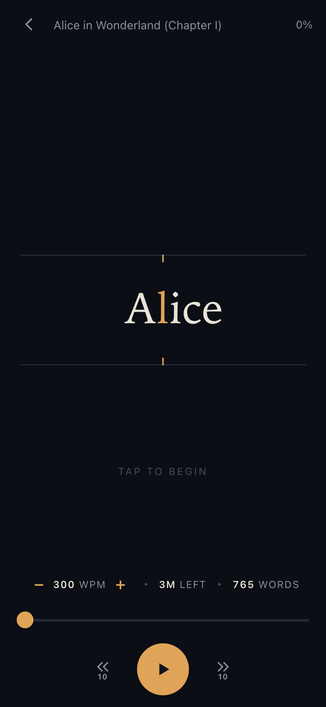

# SpeedRead

A speed-reading PWA built around **RSVP** (Rapid Serial Visual Presentation): one word at a
time, at one fixed point, so your eyes never move. Fully static, fully offline — everything
lives in your browser.



## Features

- **RSVP reader** — words are pinned to their *optimal recognition point* (the ~30% character,
  highlighted in amber) so the fixation point never shifts. Guide rails with a center notch
  give your eye somewhere to rest.
- **Adaptive timing** — sentence-ending punctuation holds ~2.1×, commas ~1.5×, long words get
  a bonus. Resuming starts 20% slower and ramps back to your target WPM over ~10 words.
- **100–700 WPM**, adjustable mid-read; 1 or 2 words per flash.
- **Import anything** — paste text, or upload `.txt` / `.epub` (EPUB is unzipped and parsed
  entirely client-side, no server involved).
- **Library with resume** — books live in IndexedDB; your position is saved per book.
- **Stats** — live WPM, words left, estimated time remaining.
- **Dark (default) & light themes**, adjustable word size.
- **Installable PWA** — works offline via a service worker; add it to your iPhone home screen.

## Controls

| Action | Gesture |
| --- | --- |
| Play / pause | Tap the word area (or Space on desktop) |
| Rewind / skip 10 words | `⏮ 10` / `10 ⏭` buttons (or ←/→ keys) |
| Scrub | Drag the position slider |
| Change speed mid-read | `−` / `+` stepper (25 WPM steps) |

## Development

```bash
npm install
npm run dev        # dev server
npm run build      # type-check + production build → dist/
npm run preview    # serve the production build locally
npm run icons      # regenerate PWA icons (pure Node, no image deps)
```

## Deployment

Every push to `main` runs `.github/workflows/deploy.yml`, which builds the app and publishes
`dist/` to the `gh-pages` branch.

One-time setup after the first push:

1. On GitHub go to **Settings → Pages**.
2. Set **Source** to *Deploy from a branch*, branch `gh-pages`, folder `/ (root)`.
3. The app appears at `https://<your-username>.github.io/<repo-name>/`.

The build uses a relative base path, so it works at any repo name without configuration.

## Install on iPhone

1. Open the deployed URL in Safari.
2. Tap **Share → Add to Home Screen**.
3. Launch from the home screen — it runs full-screen and offline.

## Architecture notes

- **Vite + React + TypeScript**, no router library — a tiny hash router keeps GitHub Pages
  happy (no 404 rewrites) and makes the iOS back-swipe work naturally.
- **Storage**: settings in `localStorage`; book metadata and full text in separate IndexedDB
  stores so listing the library never loads book bodies.
- **EPUB parsing**: [`fflate`](https://github.com/101arrowz/fflate) unzips the archive, then
  the OPF spine is walked and text extracted per chapter with `DOMParser`.
- **Service worker**: network-first for navigations (deploys show up promptly), cache-first
  for hashed build assets.
- **Icons**: generated by `scripts/gen-icons.mjs`, which renders the artwork per-pixel and
  encodes the PNGs by hand — no image tooling in the dependency tree.
